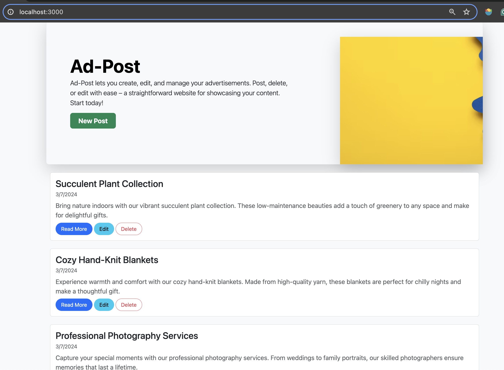
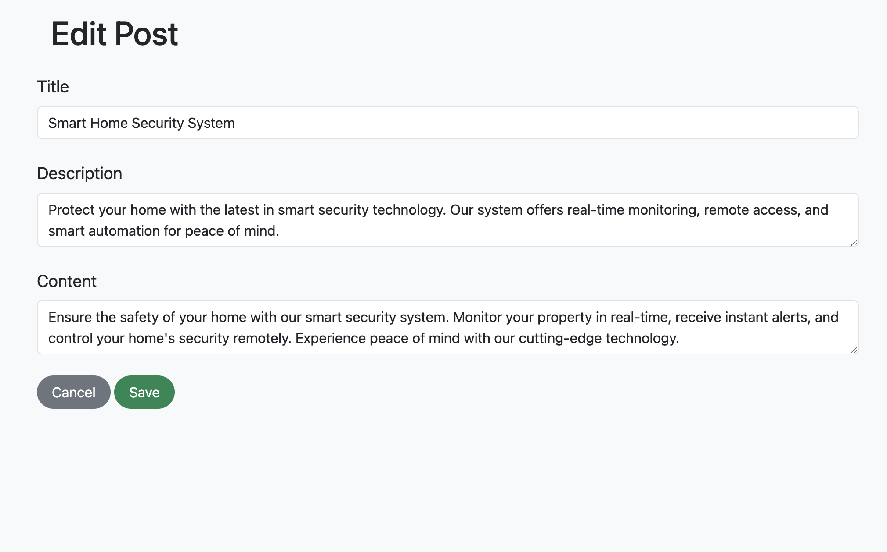

# Project-2---Ad-post
# Ad-Post forum

## Description

This project serves as a basic platform for managing Ad-post, allowing users to create, edit, view, and delete Posts. It utilizes a MongoDB database to store article data and EJS templates for rendering dynamic content.

## Getting Started

To access the app, you can clone the files to a local computer. Then start the server with Nodemon and go to <http://localhost:3000/>

## Screenshot

## Technologies Used

- HTML
- CSS
- Javescript
- Node.js
- Express
- MongoDB
- EJS
- Bootstrap
- Google’s OAuth

## Next Steps

Planned future enhancements include:

- **User Authentication:**
  Implement user authentication to allow users to sign up, log in, and manage their own post.

- **Browse by Category:**
  Enhance the system by adding categories to articles, allowing users to browse articles based on different categories.

- **Additional Layouts:**
  Create more layouts and styles to improve the overall user experience. Consider responsive designs for various screen sizes.

Feel free to contribute to the project.